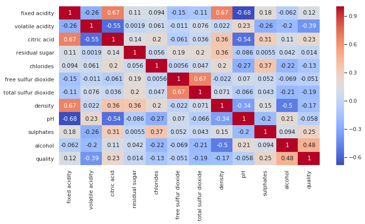
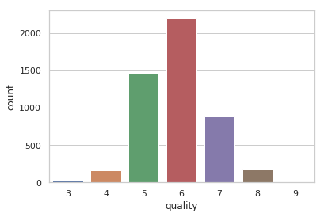

# Wine-Quality-Prediction---Kaggle-challenge

In this work we analyse two datasets on wine quality available from the UCI machine learning repository (http://archive.ics.uci.edu/ml/datasets/Wine+Quality).

### Dependencies
The code is in python. Other than this, please install the following libraries using pip.
* Pandas: pip install pandas
* matplotlib: pip install matplotlib
* numpy: pip install numpy
* scikit-learn: pip install scikit-learn

Assumption
We will be assuming that wines having value higher than 6 will be considered good and other wines are not good.

The following features can be excluded as they have small correlation with wine type:
- citric acid
- pH
